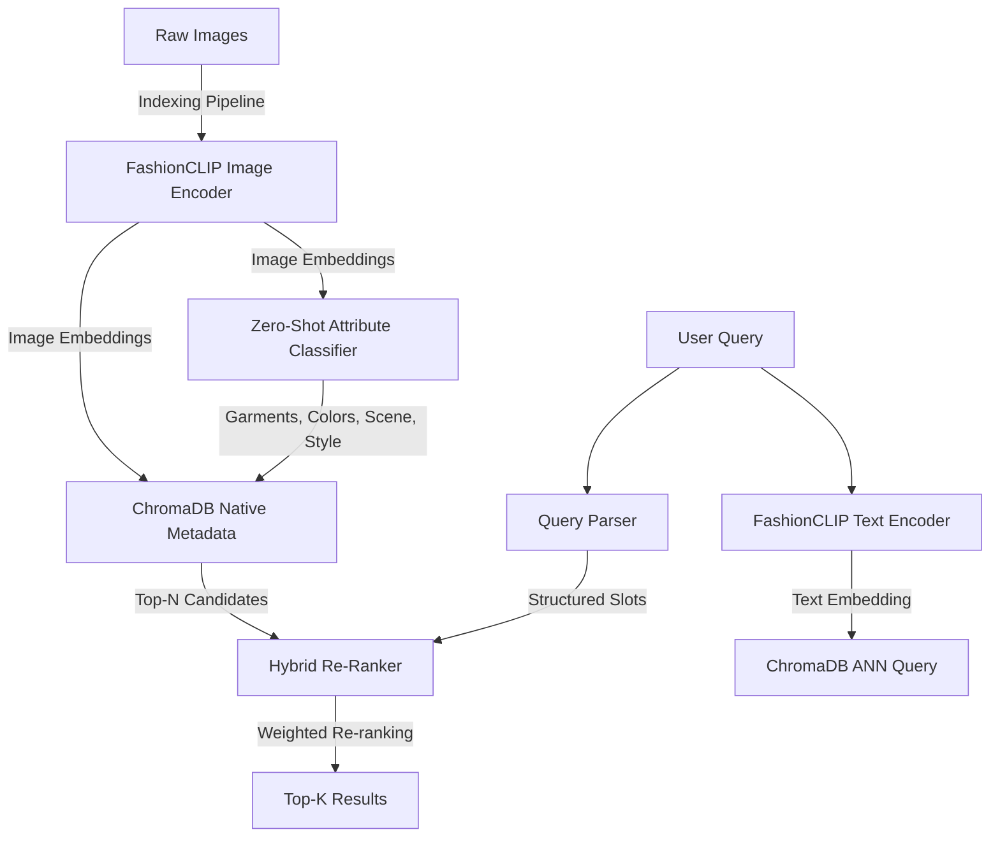

# Hybrid Fashion & Context Retrieval System

This repository implements a **Hybrid Retrieval System** that addresses vanilla CLIP's compositionality weaknesses (e.g., distinguishing "red shirt and blue pants" from "blue shirt and red pants") using a two-stage pipeline: **FashionCLIP Semantic Recall** + **Structured Zero-Shot Attribute Matching & Re-ranking**.

Built as a submission-ready machine learning internship assignment.

---

## Architecture Overview



### 1. Two-Stage Retrieval Strategy
1. **Semantic Recall (Stage 1)**: The raw query text is encoded using **FashionCLIP** (`patrickjohncyh/fashion-clip`). A fast Approximate Nearest Neighbor (ANN) search is executed against ChromaDB to retrieve the top $N$ candidates (e.g., $N=20$).
2. **Compositional Re-ranking (Stage 2)**: Candidates are re-ranked using a **Structured Attribute Match Score** calculated by comparing parsed query slots against the structured metadata extracted at indexing time. 

$$\text{Final Score} = 0.6 \times \text{CLIP Similarity} + 0.4 \times \text{Attribute Match Score}$$

### 2. Solving the Compositionality Weakness
OpenAI CLIP embeds images globally and struggles to associate specific colors with specific garments. We resolve this by performing **Zero-Shot Hierarchical Attribute Extraction** at indexing time:
- We first identify which garments are present using zero-shot detection.
- For each detected garment, we classify its color by evaluating it against a joint garment-color prompt set (`"a photo of a person wearing a {color} {garment}"`).
- This binds colors strictly to their respective garments (e.g., locking "red" to "tie" and "white" to "shirt") in the metadata.

---

## Repository Structure

```
fashion-search/
├── requirements.txt              # Pinned python dependencies
├── evaluation_report.md          # Generated evaluation report for the 5 official queries
├── data/
│   ├── raw/                      # Downloaded Fashionpedia + Unsplash images (gitignored)
│   ├── metadata/                 # Manifest logs
│   └── vector_db/                # Persistent local ChromaDB database (gitignored)
├── indexer/
│   ├── vocab.py                  # Shared vocabulary of garments, colors, scenes, and styles
│   ├── embed.py                  # FashionCLIP model wrapper for CPU/GPU embedding
│   ├── attributes.py             # Zero-shot structured attribute extractor
│   ├── vector_store.py           # ChromaDB client wrapper
│   └── run_indexer.py            # CLI entry point to index raw images
├── retriever/
│   ├── query_parser.py           # Rule-based natural language query parser
│   ├── search.py                 # Hybrid retriever and re-ranking core
│   └── run_query.py              # CLI entry point to query the search engine
└── scripts/
    ├── download_dataset.py       # Dataset assembler script (Fashionpedia + Unsplash CDN)
    └── eval_report.py            # Evaluator script for the 5 official queries
```

---

## Setup Instructions

### Prerequisites
- Python 3.11 or 3.12 (highly recommended).
- Internet connection (to download model weights and dataset).

### Installation
1. Clone the repository and navigate to the project directory:
   ```bash
   git clone [INSERT REPO URL]
   cd fashion-search
   ```
2. Install the required dependencies:
   ```bash
   pip install -r requirements.txt
   ```

---

## Running the Pipelines

### 1. Download the Dataset
We build a dataset of 610 images combining product-style shots from Fashionpedia (HuggingFace datasets) and real-world scenes from Unsplash.
```bash
python scripts/download_dataset.py --fashionpedia_limit 500 --unsplash_limit 30
```

### 2. Run the Indexer
Extract features and build the searchable vector index in ChromaDB:
```bash
python -m indexer.run_indexer --batch_size 16
```

### 3. Run a Search Query
Run searches from the command line:
```bash
python -m retriever.run_query --query "Someone wearing a blue shirt sitting on a park bench." --top_k 3
```

### 4. Run the Evaluation Report
Generate the evaluation report for all 5 assignment queries:
```bash
python -m scripts.eval_report
```
The results will be written to `evaluation_report.md`.
